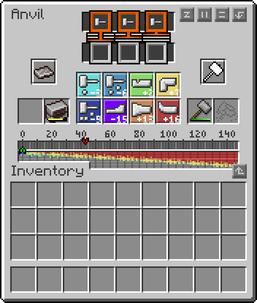
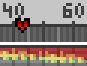
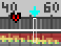
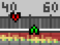
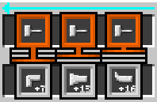

# PerfectAnvilTFG

A resource pack for TerraFirmaCraft (TFC) that provides a "Perfect Anvil" GUI helper.

# Usage

Check where the current red arrow is (in this case, 43, since each pixel counts as 1).

Subtract the red arrow value by the sum of the last three required actions highlighted in orange at the top (treating "Any Hit" as a Light Hit or -3, results in a total of -9). In this example, it would be `43 - (-3 - 3 - 3) = 43 - (-9) = 52`. This value of `52` is where you want to place your green arrow.

Using the pixel guides, count the colors of the pixels and press the action corresponding to each color that many times. In this case: 2 Shrinks (Red) and 3 Bends (Yellow).

Now, your green arrow should be placed at 52.

You can now finish forging by performing the highlighted actions in reverse (though in our case, they are all Light Hits), thus aligning the green arrow with the red arrow.

## Credits

This resource pack is a derivative of [Anvil GUI](https://www.curseforge.com/minecraft/texture-packs/tfc-anvil-helper) by Simon, used under [CC BY 4.0](https://creativecommons.org/licenses/by/4.0/).

## Changes made

- Corrected the hit indicators for 3, 6, 19, and 22 hits in the anvil GUI texture.

## License

This project is licensed under the Creative Commons Attribution 4.0 International License.
